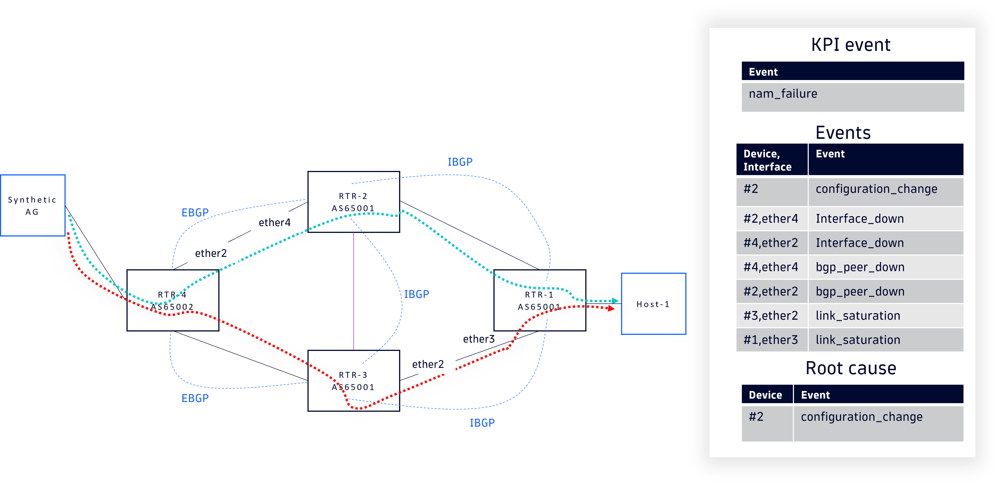
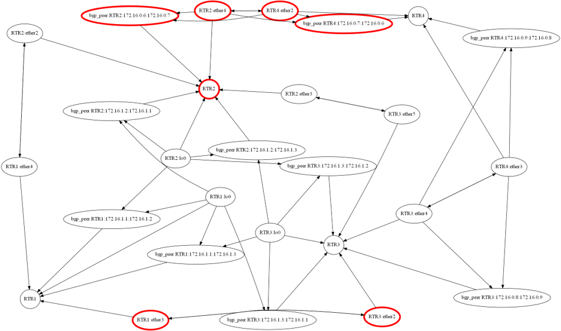

# Network Full RCA

## Glossary

 Network: a group of network devices providing conectivity services to clients.

 Full RCA: High quality root causes:

- Actionability: is it linked to a remediation with "high" probability?
- Conclusiveness: is it a terminal root cause?
- Low "false positive" optimization. Compromise with "false negative".

## Short Abstract / Blogline

"Network RCA" is an unmature domain. There is no well-know solution we can "implement" and would deliver the "full" promise. This VI describe a framework and name use cases that will be addressed.

Dynatrace intelligence identifies the root cause of physical network problems by correlating Health Alerts, Warning Signal, Info events and topology into a causal chain.
It applies to all scenarios where KPIs of all sorts (OneAgent process to process, NAM, RUM) are assessing the network performance.

It starts the journey to bring Dynatrace to feature parity with market leaders (NetAI and Selector AI) in the network RCA domain. The identified use cases will be gradually addressed by complexifying the analyzers over time while meeting the GA constraints.

It improves [Process network problem enriched with network events](https://dt-rnd.atlassian.net/browse/PRODUCT-15022) and depends on  concepts introduced by it like network device events grouping.

### Reference

[Network RCA Powerpoint](https://dynatrace-my.sharepoint.com/:p:/p/benoit_lourdelet/IQAaG2J9AXUqTYOK1brYe4AZAb5sNL6JiR_rx1il5oEun4k?e=srB1up)

## Customer Zero

- EDE (Dynatrace internal IT) — Use cases: ACI fabrics, Campus networks.
- External design partner with physical network monitored by Dynatrace: A customer advisory board will be formed to gather feedback and manage preview in an efficient way. To name a few: Total Energies, Merck, Siemens Healthineers, Fedex, SAFRAN, etc.

## Target Audience

- **Network Operations (NetOps) engineers** — first responders for physical network incidents, today forced to swivel-chair between Dynatrace and dedicated network tools
- **Application owners** — recipients of "network problem" alerts who need the Application RCA prolonged to the  individual network device.
- **SRE / Platform teams** — owners of multi-tool observability stacks where the network is the last unobserved layer in Dynatrace
- **CIOs / CTOs** — sponsors evaluating consolidation onto a single full-stack observability platform. Once this VI is executed, Dynatrace becomes the uncontested causal end-to-end RCA leader.

## WHY

Today, when Dynatrace intelligence raises a process-to-process "network problem", the analysis stops at the host boundary. The user is told *that* the network is slow or dropping packets, but not *which device, link, or change* in the physical network caused it. Network RCA VI ([PRODUCT-15022](https://dt-rnd.atlassian.net/browse/PRODUCT-15022)) closed part of this gap by surfacing all events in the relevant group of network devices, but the user is still left to read through dozens of events to find the actual culprit.

### Where It Hurts

#### Manual triage in the network area

- **What happens:** Dynatrace intelligence lists every event from every devices in the network area between two processes
- **Where it shows up:** Network problem details, handover tickets to NetOps
- **User symptoms:** potentially 20+ events to manually correlate, long MTTR

#### No causal chain across topology

- **What happens:** A single root event (e.g. a flapping uplink, an OSPF adjacency reset, a BGP peer down, etc.), cascades into many symptoms; Dynatrace shows the symptoms, not the cause
- **Where it shows up:** Multiple parallel "network problem" alerts, multiple paging events
- **Symptoms:** Alert fatigue, parallel war-rooms for the same underlying fault

#### Competitive analysis

- **What happens:** A crowded field of vendors (Selector AI, NVIDIA, NetAI, SolarWinds, LogicMonitor, SumoLogic, Juniper Mist, NetBrain, Kentik) already delivers some form of causal or correlation-based network RCA. See the **Competitive Landscape** section for the full capability matrix.
- **Where it shows up:** Difficulties to add networking to end-to-end deals by the lack of Dynatrace differentiators in this domain. Lack of a competitive edge with DDOG in the infrastructure area.
- **Symptoms:** Dynatrace cannot credibly position as "true full-stack Dynatrace Intelligence" in network-heavy accounts.

### Why now?

- [PRODUCT-15022](https://dt-rnd.atlassian.net/browse/PRODUCT-15022) (Application service problem enrichement) and [PRODUCT-17449](https://dt-rnd.atlassian.net/browse/PRODUCT-17449) (HA&WS&INFO Phase II) are in flight — this VI is the natural next step that converts those building blocks into customer value.
- Physical topology is available, part of June'26 rally.
- Network-RCA is a fast-moving market segment; delaying entry widens the gap vs. specialized tools unique capabilities.
- DDOG does not show sign of interst in the domain. The assumption is that the lack the needed infrastructure similar to Grail. Given the projected long time span of the  full execution of this VI, it is better to start now.

## Competitive Landscape

Source: [Network RCA competitive PPTX](https://dynatrace-my.sharepoint.com/:p:/p/benoit_lourdelet/IQD1PvbU7Z5xSKuTsSHx7mCOAW11GQINHP0aKa7lBe_BbL0?e=QQAHMT)

### Capability Matrix

Adapted from competitive deck slides 4 and 60. Legend: ● = strong / native, ◐ = partial / limited scope, ○ = absent or undocumented. *Dynatrace columns reflect the target post-GA state of this VI.*

| Capability axis | Selector | NVIDIA | NetAI | SolarWinds | LogicMonitor | SumoLogic | Juniper Mist (wifi) | BigPanda | Datadog | Kentik | **Dynatrace (today)** | **Dynatrace (post-VI)** |
| --- | --- | --- | --- | --- | --- | --- | --- | --- | --- | --- | --- | --- |
| KPI-triggered analyzer | ○ | ◐ | ◐ | ◐ | ● | ◐ | ◐ | ○ | ◐ | ◐ | ● | ● |
| External metadata (NetBox/CMDB/SNow) | ● | ◐ | ◐ | ◐ | ◐ | ○ | ○ | ◐ | ◐ | ◐ | ◐ | ● |
| Static, user-defined causality | ● | ● | ● | ● | ● | ◐ | ● | ● | ◐ | ◐ | ● | ● |
| Topology-based causality | ◐ | ◐ | ● | ◐ | ● | ○ | ◐ | ○ | ○ | ◐ | ◐ | ● |
| User-tunable causality algorithm | ● | ● | ◐ | ○ | ○ | ○ | ○ | ◐ | ○ | ○ | ○ | ◐ |
| Full-stack context (app → network) | ◐ | ○ | ○ | ◐ | ◐ | ◐ | ○ | ◐ | ● | ○ | ● | ● |

### Dynatrace's Differentiated Position

1. **Topology-based causality with full-stack reach.** Davis® already does causal RCA across app → service → host → cloud. This VI extends the same causal model to the physical network. No competitor has the upper stack; no full-stack platform has the lower stack.
2. **KPI-triggered, explainable analyzer.** Unlike Selector's continuous tag correlation, the analyzer runs on a real symptom (a Davis network problem). Each candidate root cause exposes the rules and signals that produced it (matches NetAI's "deterministic" promise).

## Use Cases

### Example

This diagram illustrates a multi-hop network path with BGP routing, showing how traffic from a synthetic AG flows through multiple routers across different AS domains to reach Host-1.

The Green dotted line is the expected NAM ping path. The Red dotted line reflects the new path after the configuaration change rerouted the NAM ping packets.

***Legend:***

- Solid lines: Data forwarding paths
- Dotted lines: Control plane connections
- EBGP: External BGP (between different AS domains)
- IBGP: Internal BGP (within same AS domain)

#### Event graphs

Based on a prototype processing the events collected in the example above, for illustration purpose only.

### Datacenter & Fabric Operations

- **UC-DC1 — Triage a fabric incident in minutes, not hours.** *(NOC engineer, datacenter provider)* An alert storm hits at 02:00. Engineer opens one Davis problem and sees: the single physical root cause (e.g. spine-leaf uplink flap), every downstream symptom merged in, the impacted applications. No swivel-chair across 5 dashboards. *(Mirrors Selector "Global Digital Infrastructure Provider" case — alert fatigue elimination, automated triage.)*
- **UC-DC2 — Multi-vendor fabric coverage.** *(Senior NetOps engineer, enterprise running Cisco ACI + Arista EOS + legacy)* A fault crosses vendor boundaries. The engineer expects one RCA, not three vendor-specific tools. Davis correlates events across all supported vendors using the network-area topology. *(NetAI's core positioning — vendor-neutral GNN modeling of the fabric.)*

### Service Reliability & Application Operations

- **UC-SRE1 — Stop blaming the network when it isn't the network (and prove it when it is).** *(SRE, e-commerce)* A latency SLO is breached. SRE needs a definitive answer: was it the app, the host, or the network? Davis Full RCA returns either a concrete network root cause (with device, interface, timestamp) or an explicit "network is healthy on this path" verdict. *(Cross-cuts every Selector customer story — eliminating cross-team finger-pointing.)*
- **UC-SRE2 — Cut MTTR for cross-domain incidents.** *(SRE on call, hybrid-cloud enterprise)* On-call SRE has 15 minutes to acknowledge and 60 to mitigate. Davis delivers the network root cause within the acknowledge window so the right team is paged from the start. *(Selector "85% MTTR reduction"; meet or exceed.)*
- **UC-SRE3 — Detect routing/path isolation before users complain.** *(SRE, content delivery)* A regional BGP withdrawal or OSPF reconvergence silently isolates a subset of users. Davis correlates packet-loss spikes with routing-plane events on the path and raises a problem before the user-experience SLO breaches. *(Selector "Proactive routing isolation detection".)*

### Network Operations Center (NOC)

- **UC-NOC1 — Suppress the alert storm; act on the one event that matters.** *(NOC supervisor, telco)* During a fabric brownout, 200+ device alerts fire. NOC sees one Davis problem with the root cause, not 200 tickets. *(Selector "95% noise reduction".)*
- **UC-NOC2 — Never miss an incident due to a human bottleneck.** *(NOC service engineer, data center provider)* Engineer is heads-down on incident A; incident B's alert would be missed under manual monitoring. Davis correlates and raises B autonomously with the root cause attached. *(Selector "100% incident capture" framing.)*
- **UC-NOC3 — Hit incident-response SLAs.** *(NOC supervisor, MSP)* Contractually committed to mean-time-to-acknowledge / mean-time-to-resolve targets. Davis reduces both by surfacing root cause at problem-open. *(Selector "Incident response SLA achievement".)*
- **UC-NOC4 — Deterministic, explainable RCA.** *(L3 escalation engineer)* Engineer will not act on a black-box "AI score". They need the rule that fired, the signals it weighed, and the topology path. Davis exposes the contributing signals for every candidate. *(NetAI core differentiator: deterministic, not probabilistic.)*

### WAN

- **UC-WAN1 — SD-WAN underlay/overlay correlation.** *(NetOps, managed service provider)* SD-WAN overlay shows a tunnel issue; the real cause is in the underlay ISP path. Dynatrace intelligence correlates the two (where underlay is observed).

## Functional Requirements / Solution Journey

### System Capabilities

The capabilities below describe what the system does to deliver the user-oriented use cases above.

- **SC1 — Causal root cause on a network problem.** When Davis raises a process-to-process "network problem", the user sees a ranked list of candidate root-cause events in the underlying physical network, each with a confidence score and an explanation of the causal link to the symptom.
- **SC2 — Evidence trail.** For each candidate root cause, the user can drill into the supporting evidence: device, interface, timestamp, raw syslog / metric / SNMP trap, and the affected topology segment.
- **SC3 — Handover-ready report.** The application owner can export or share the causal chain (root cause + evidence + impacted processes) as a single artifact suitable for a NetOps ticket.
- **SC4 — Multi-vendor device support.** Causal RCA operates on devices monitored by Dynatrace network extensions implementing generic entities.
- **SC5 — Network-healthy verdict.** When the analyzer finds no plausible network root cause, it returns an explicit "network healthy on this path" verdict with the signals it considered (supports UC-SRE1).

### Solution Concept

- A new **Dynatrace Intelligence Network analyzer** is triggered whenever:

- a process-to-process "network problem" is raised.
- a nework KPI measured by NAM or any other mean is not met.

- The analyzer resolves the link between the faulty KPI or Service Problem and network device group defined by "Network RCA" ([PRODUCT-15022](https://dt-rnd.atlassian.net/browse/PRODUCT-15022)).
- It collects all device-level signals (health alerts, warning signals and INFO events) emitted by devices on the path within a configurable temporal window around the symptom.
- A causal-inference step ranks candidate root causes using:
  - Temporal precedence (cause precedes symptom)
  - Topological proximity (event is on the affected path)
- Known causal patterns (e.g. interface down → adjacency reset → traffic loss)
  - Signal severity and Dynatrace's existing Davis correlation logic
- The top-ranked event(s) are surfaced inside the existing "Application network" or "KPI not met" Problem with a "Root cause" section and a "View causal chain" action.
- Symptom-only events are demoted to "Related events".

#### Identified root cause

- Nework device related Info event, Business events, Health alerts.

#### Analyzer components

- Network device Health Alerts, Warning signals and INFO events

### Dependencies

#### Intra network devices

- Device availability-Environment
- Device availability- Control plane
- Device availability- Fan/PSU
- Control plane – routing protocol
- Routing protocol - Interface
- Interface L1-L2
- Interface L2-L3
- Bundle interface

#### Inter network devices

- Routing protocol (BGP, EIGRP, OSPF, IS-IS)
- First Hop (HSRP, VRRP)
- Generic adjacency (BFD)

#### Common properties

- Interface IP/Subnet mask
- VLAN
- BGP autonomous system

### Implementation

#### Phase 0

Time based event gathering: Provided by Network RCA VI ([PRODUCT-15022](https://dt-rnd.atlassian.net/browse/PRODUCT-15022))

#### Phase I

One hop events, causal pattern , Phase 0

See the example diagram above.

#### Phase II

Full causality graph traversal

## Non-Functional Requirements

- **Scalability:** Analyzer must handle network areas up to 100 devices and process paths up to 10 hops.
- **Accuracy:** For supported scenarios (see SC5), top-1 candidate matches operator-identified root cause in ≥70% of validated incidents; top-3 in ≥90%.
- **Explainability:** Every ranked candidate must expose the rule(s) and signals that contributed to its score — no black-box scoring.
- **Reliability:** If the causal analyzer fails or times out, the existing [PRODUCT-15022](https://dt-rnd.atlassian.net/browse/PRODUCT-15022) "all events in network area" view must remain available (graceful degradation).
- **Cost-awareness:** Analyzer runs based on network problem trigger or at minutes interval, not as a continuous stream.

## Enablement Requirements

- **Support:** NetOps-focused runbook; training session for L2/L3 support on interpreting causal chains and false-positive handling
- **Internal Adoption:** Used by the EDE team as early as possible.
- **Pricing:** Analyzers are not zero-rated.
- **Marketing:** Launch blog ("Dynatrace intelligence goes full-stack — now down to the wire"), Highspot battlecard vs. NetAI / Selector, demo video, Perform 2027 session pitch
- **Sales:** Sales deck update, competitive playbook (NetAI / Selector), ROI calculator (MTTR reduction, tool consolidation savings)

## E2E Acceptance Criteria

1. **Root cause surfaced:** For every supported "network problem" , the problem card displays a "Root cause" section with at least one ranked candidate event from the physical network — or an explicit "No root cause identified" state with reasoning.
2. **Causal chain visible:** User can open a causal-chain view showing root cause → intermediate signals → impacted processes, with topology context.
3. **Multi-symptom merge:** When ≥2 simultaneous "network problem" alerts share the same root cause, Davis merges them into a single problem; merge decisions are explainable.
4. **Accuracy gate:** On the Customer-Zero validation set (≥30 labeled incidents), top-1 ≥ 70%, top-3 ≥ 90%; below threshold blocks GA.
5. **Graceful degradation:** If causal analysis fails, the existing [PRODUCT-15022](https://dt-rnd.atlassian.net/browse/PRODUCT-15022) "network area events" view is shown unchanged.

## Customer Zero Planning

- **Phase 1 (Internal — EDE):** Enable on Dynatrace EDE tenants; collect ≥30 labeled incidents over one quarter; iterate on ranking model.
- **Phase 2 (Private Preview):** Invite 2–3 design-partner customers with mature physical-network monitoring; weekly feedback sessions for one quarter.
- **Success criteria for promotion to Public Preview:** AC6 (accuracy gate) met on combined Phase 1 + Phase 2 incidents; ≥3 documented MTTR-reduction case studies.

## E2E Demo (for acceptance)

1. Set up an environment where two monitored processes communicate across a physical network.
2. Inject a controlled fault on the network.
3. Observe Dynatrace raise a "network problem" between the two processes within the expected Davis cycle.
4. Open the problem and show the "Root cause" section: top candidate = the injected fault, with explanation.
5. Open the causal-chain view: root cause → intermediate signals → impacted processes.
6. Trigger a second, parallel symptom from the same fault and show that Davis merges both into one problem.

## Out of Scope

- Internet Service Provider, 5G  core networks.
- Wifi RCA (Juniper Mist, Arista) — vendor-native depth not pursued
- Generic AIOps event-correlation tool-of-tools.
- Network automation runbooks (NetBrain) — out of charter for this VI
- No integration with generic third party topology provider expect the one coming from supported extensions like Cisco Catalyst Center, Aruba Central, Cisco ACI, etc.

## Success Metrics

Evaluated 3–6 months post-GA:

- **Adoption:** ≥40% of "network problem" alerts in adopting tenants are opened to view the Root-cause section (vs. baseline 0)
- **Accuracy in the wild:** ≥65% positive feedback (thumbs-up) on the top-1 candidate root cause
- **MTTR reduction:** ≥30% reduction in time-to-resolution for network problems in adopting tenants vs. their pre-GA baseline
- **Alert consolidation:** Average number of parallel "network problem" alerts per underlying fault reduced by ≥50% (measured via merge ratio)
- **Commercial impact:** ≥5 new logos or renewals citing network RCA as a decisive capability; ≥3 documented displacements of NetAI / Selector
- **Self-monitoring:** P95 root-cause latency ≤ 60s sustained; analyzer failure rate < 1%

## Cost Analysis

- **Customers:** Follows the analyzer cost structure.
- **Dynatrace (compute):** Analyzer runs only on-demand per network problem. Estimated marginal DQL cost: small (bounded by path length × time window × signals-per-device). Expected to be well within existing analyzer budgets.
- **Savings:** Reduced support load for "why did the network problem alert not point to anything?" cases; reduced churn risk in network-heavy accounts.
